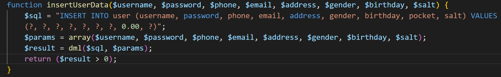
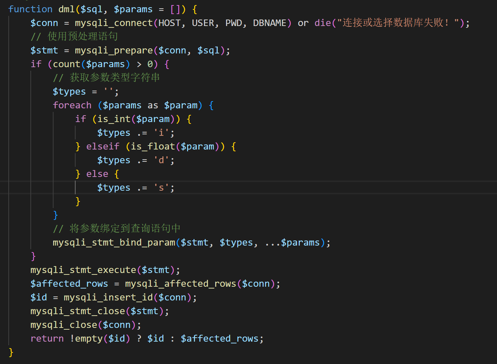
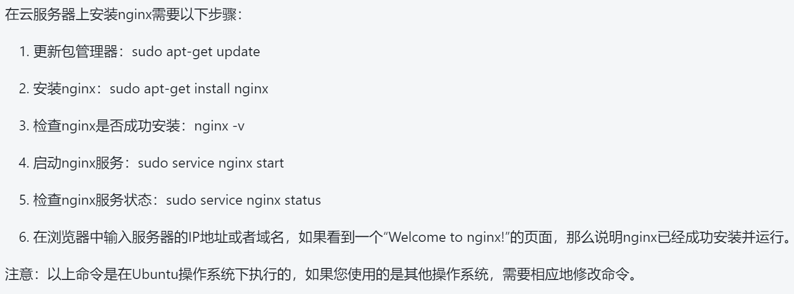
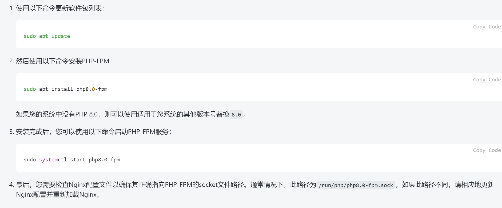
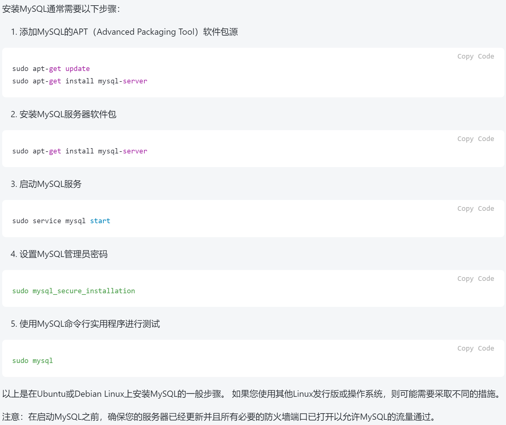
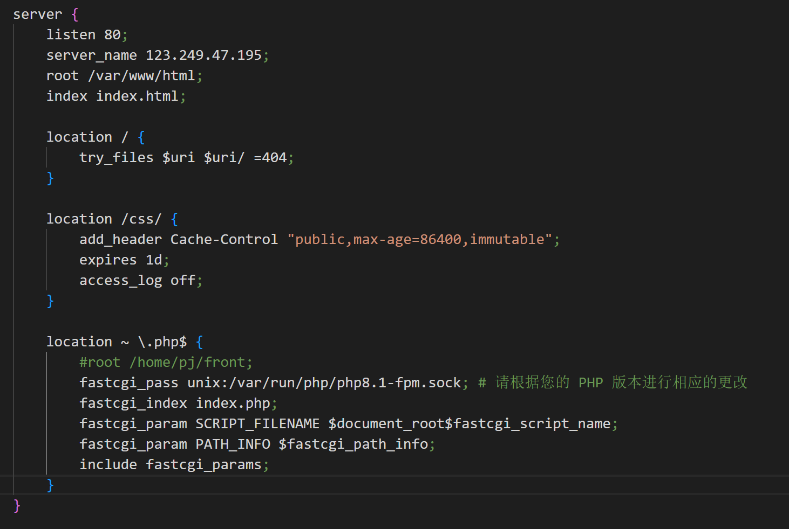
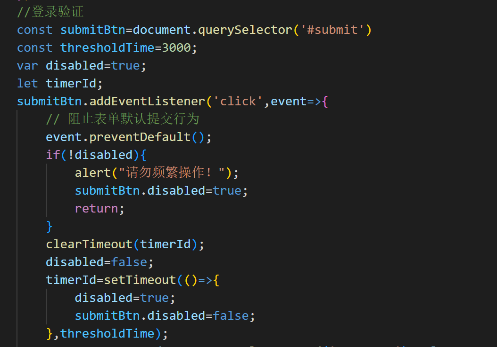

# 有关(*)项的实现原理的文档说明

## (1)防止SQL注入

在本次pj中，php防止sql注入的主要实现原理是预处理和参数化查询。

如`insertUserData()`函数中的sql查询语句使用了占位符(?)来代替实际的参数值，然后将参数添加到一个数组$params中，在调用`dml()`函数时将sql查询语句和参数数组一起传递过去。

在`dml()`函数中，使用`mysqli_prepare()`函数创建了一个mysqli_stmt对象，并将sql查询语句与参数分离。然后，使用`mysqli_stmt_bind_param()`函数将参数绑定到查询语句中。在这个过程中，参数值会被转义并包含在查询语句中，从而避免了 SQL 注入攻击。最后，执行查询语句使用 `mysqli_stmt_execute()` 函数进行查询，而不是直接执行 SQL 查询语句，也能够帮助防止 SQL 注入攻击。

## (2)、部署。

我的pj部署在华为云服务器上，部署服务器公网IP为`123.249.47.195`。

我部署的主要实现步骤为华为云官网申请云服务器(我申请的云服务器为官网试用，试用期为一个月)，获取云服务器IP，使用vscode连接到云服务器，这里需要在vscode上安装部分插件，接下来的步骤为：

1.安装nginx：

2.安装php及相关拓展：

3.安装mysql：

4.将pj代码上传到服务器上，这里建议将html/css/js/php代码上传到var/www/html路径下。

5.修改相关配置文件nginx.conf，如：

大致的实现步骤就是这样，但具体实现过程中大概率会出bug，我在部署过程中就因为php未配置mysqli扩展而一直连接不上mysql数据库，这里建议通过查看nginx的日志文件(/var/log/nginx/error.log)来排除bug的产生。

## (3)、用户画像。

我的做法是结合艺术品的访问量和用户的访问记录为每件艺术品进行打分，即`艺术品评分=访问量打分+访问记录打分`，将评分最高的10件艺术品展示在“猜你喜欢”区域。具体的评分规则为首先获取全部艺术品的数据并获取全部艺术品中最高的访问量，遍历全部艺术品数据，为其加分——(当前艺术品访问量)*5/(最高的艺术品访问量)，这一打分设计的主要考虑是如果用户为新注册用户，其未产生访问记录，因此希望通过这个基础分为新注册的用户也可以推荐艺术品；其次获取当前登录用户针对每个艺术品的访问记录，如果有访问记录则为艺术品进行相应加分，这里考虑到不同访问记录的访问时间不同，相应的加分也因有所不同，此处具体实现规则，访问时间与当前时间间隔小于1天，加5分；大于1天小于3天，加4分；大于3天小于7天，加3分；大于7天小于一个月，加2分；大于一个月，加一分。具体实现参考代码。

## (4)、点击过快。

以登录为例，用户点击登录按钮后,将设置disabled=false,同时开启一个计时器，这里设置的时间阈值为3秒，用户再次点击后由于disabled=false，因此将弹出提示信息“请勿频繁操作”，同时设置submitBtn.disabled=true，使得用户不能再次点击，即拒绝用户操作。只有当计时器计时结束后，submitBtn.disabled才会再次为true，用户才可以再次点击登录按钮。
